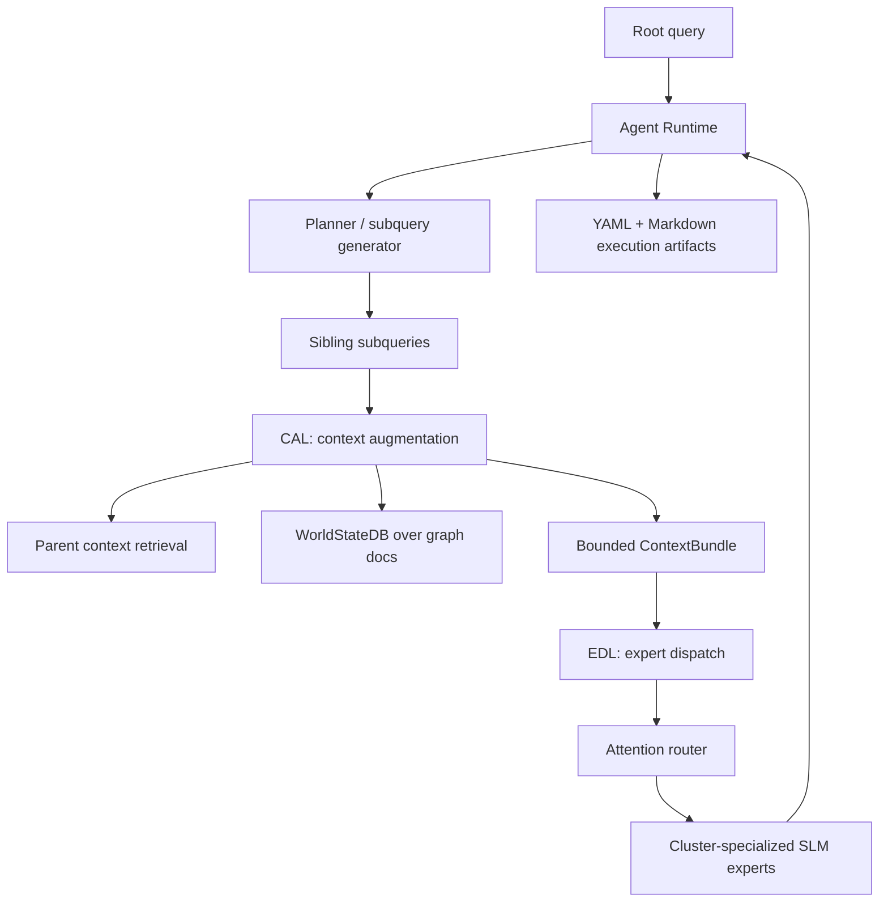

# Dullahan

Dullahan is an experimental app that orchestrates an agent swarm that performs
hierarchical task execution by dispatching specialized SLM-based agents to a
clustered, dynamically growing and morphing context graph to solve complex tasks
with reliable context control and modular expert delegation.

It is built for tasks where the hard part is not a single model call, but keeping
many smaller reasoning steps grounded in the right local context. Dullahan stores
knowledge as graph memory, partitions that memory into expert-owned clusters,
uses a Context Augmentation Layer (CAL) to build bounded context for each
subquery, and uses an Expert Dispatch Layer (EDL) to route work to the most
relevant specialist agent.

The project is intentionally modular: CAL, EDL, the agent runtime, the graph
builder, MCP tools, and filesystem memory all communicate through typed
contracts from `packages/shared`.

## Why This Exists

Large tasks often fail because context is too broad, too stale, or too entangled.
Dullahan explores a different pattern:

1. Break a root task into bounded subqueries.
2. Retrieve only the context each subquery needs from parent reasoning and
   long-term graph memory.
3. Route the contextualized subquery to a specialized expert.
4. Let experts recursively ask their own subquestions when needed.
5. Persist the execution as inspectable YAML and Markdown.

The aim is reliable context control: each expert receives a focused slice of the
world instead of a giant prompt, and each step leaves behind artifacts that can be
audited, replayed, or used for later distillation.

## What Is In The Repo

| Area | Purpose |
| --- | --- |
| `apps/agent-runtime` | Recursive hierarchical execution loop, CLI, local and HTTP CAL/EDL tools, tracing, artifacts. |
| `apps/cal` | Context Augmentation Layer. Merges parent context with WorldStateDB retrieval and enforces token budgets. |
| `apps/edl` | Expert Dispatch Layer. Routes subqueries to experts with embedding attention and runs expert instances. |
| `apps/graph-builder` | Builds K-sized graph clusters and can derive `experts.yaml` from those clusters. |
| `apps/mcp-servers` | Dependency-light stdio JSON-RPC MCP surfaces for `send_to_CAL` and `send_to_EDL`. |
| `packages/kg` | Knowledge graph model, YAML graph storage, and K-partitioning. |
| `packages/world-state` | Local persistent vector index over graph-backed Markdown documents. |
| `packages/shared` | Pydantic schemas, IDs, deterministic embeddings, and retrieval helpers. |
| `memory/` | Seed graph, cluster docs, expert registry, execution artifacts, and local indexes. |
| `configs/` | Runtime recursion, retrieval, routing, and local configuration. |

## Architecture



The key runtime contracts are:

| Contract | Meaning |
| --- | --- |
| `QueryEnvelope` | The root query or generated subquery, including sender, query ID, depth, and metadata. |
| `ContextBundle` | Documents retrieved for a specific query, with optional token budget. |
| `ExpertProfile` | A specialist agent bound to a graph cluster and role context document. |
| `ExpertResponse` | The answer returned by an expert for one contextualized subquery. |
| `ExecutionSpan` | Trace metadata for runtime, CAL, EDL, timeout, and subquery events. |

## Ideal Use Cases

Dullahan is a good fit when you want many small, specialized agents to work over
a structured body of knowledge:

| Use case | Why Dullahan fits |
| --- | --- |
| Large codebase analysis | Files, classes, services, and docs can become graph nodes; experts specialize by cluster. |
| Infrastructure reasoning | Cloud resources, IAM boundaries, deployment workflows, and observability docs can be separated into expert domains. |
| Research synthesis | Papers, concepts, figures, datasets, and claims can be represented as graph memory with specialist reviewers. |
| Enterprise knowledge assistants | Teams, systems, SOPs, incidents, and domain docs can be routed to scoped expert agents. |
| Multi-step planning | Recursive subqueries make task decomposition explicit and inspectable. |
| Training data generation | YAML/Markdown traces provide structured examples for later distillation or evaluation. |

Dullahan is less ideal for one-shot chat, simple RAG over a small folder, or
tasks where a single general-purpose model call is already sufficient.

## Quickstart

### 1. Install

From the repository root:

```bash
python -m pip install -e ".[dev]"
```

This installs the CLI entrypoints:

```bash
dullahan-agent
dullahan-cal
dullahan-edl
dullahan-mcp-cal
dullahan-mcp-edl
dullahan-graphify
```

The `graphify` command used by `dullahan-graphify` is provided by the
`graphifyy` package from `safishamsi/graphify`.

### 2. Graphify A Data Collection

Point the CLI at a file or directory collection to construct graph memory from
that world state:

```bash
dullahan-graphify ./research/market-notes --k 8
```

`dullahan-graphify` invokes the real
[`safishamsi/graphify`](https://github.com/safishamsi/graphify) CLI, imports its
`graphify-out/graph.json`, converts that graph into Dullahan's YAML graph
memory, partitions it into K-sized clusters, and regenerates the expert registry
from those clusters.

The generated memory lands in:

```text
memory/graph/graph.yaml
memory/graph/clusters.yaml
memory/graph/experts.yaml
memory/documents/nodes/
memory/documents/clusters/
memory/world_state/indexes/local.json
```

Useful graphification options:

```bash
dullahan-graphify ./research/market-notes \
  --k 6 \
  --graphify-command graphify \
  --graphify-output-dir ./graphify-out
```

If you already have a `graphify` output file, import it directly:

```bash
dullahan-graphify ./research/market-notes \
  --from-graphify-json ./graphify-out/graph.json \
  --k 6
```

### 3. Run A Local In-Process Execution

The fastest path runs the agent runtime, CAL, and EDL in one process:

```bash
dullahan-agent "Assess whether a long volatility strategy is attractive before this week's major earnings releases" --max-depth 1
```

Useful options:

```bash
dullahan-agent "Build a multi-factor trade thesis for rotating from mega-cap tech into regional banks" \
  --max-depth 2 \
  --max-breadth 3 \
  --max-total-instances 12 \
  --persist-artifacts
```

For the full structured result:

```bash
dullahan-agent "Explain the key risks in a pairs trade between two semiconductor stocks" --max-depth 1 --json
```

### 4. Inspect Artifacts

When `--persist-artifacts` is set, Dullahan writes a run folder under
`memory/executions/<trace_id>/`.

Each run contains aggregate files:

```text
queries.yaml
contexts.yaml
responses.yaml
trace.yaml
manifest.yaml
action_graph.json
action_graph.mmd
final_response.md
```

It also writes per-query instance folders:

```text
instances/<query_id>/query.yaml
instances/<query_id>/context.yaml
instances/<query_id>/responses.yaml
instances/<query_id>/summary.md
```

This is the filesystem memory surface: you can inspect what each agent asked,
what context CAL supplied, which expert EDL selected, and what the expert
returned.

### Exported Action / Inference Graph

Every persisted run also exports the completed hierarchical action graph:

| File | Purpose |
| --- | --- |
| `action_graph.json` | Machine-readable graph for downstream programs, graph databases, dashboards, notebooks, or web visualizers. |
| `action_graph.mmd` | Mermaid flowchart for quick visualization in Markdown viewers, Mermaid Live, or Mermaid CLI. |

The JSON graph uses this shape:

```json
{
  "schema": "dullahan.action_graph.v1",
  "trace_id": "trace:...",
  "root_query_id": "query:...",
  "nodes": [
    {
      "id": "query:...",
      "label": "Short query label",
      "depth": 1,
      "sender_id": "query:parent",
      "query": {},
      "context": {},
      "response": {},
      "responses": []
    }
  ],
  "edges": [
    {
      "id": "query__parent__to__query__child",
      "source": "query:parent",
      "target": "query:child",
      "query": "The subquery text that created this edge",
      "label": "Short edge label"
    }
  ]
}
```

In other words, graph nodes are query instances with their `(query, context,
response)` payloads, and graph edges are parent-to-child query delegations labeled
by the child query. `response` contains the primary expert response when one
exists, while `responses` preserves the full list. The JSON format is deliberately
plain so it can be loaded by tools such as NetworkX, Cytoscape.js, D3, Graphistry,
or a custom dashboard.

To render the Mermaid graph with Mermaid CLI:

```bash
mmdc -i memory/executions/<trace_id>/action_graph.mmd \
  -o memory/executions/<trace_id>/action_graph.svg
```

## Run CAL And EDL As Services

Start CAL and EDL with Docker Compose:

```bash
docker compose up cal edl
```

Then call them from the runtime over HTTP:

```bash
dullahan-agent "Evaluate whether a steepener trade makes sense given inflation, growth, and Fed path assumptions" \
  --transport http \
  --cal-url http://127.0.0.1:8100 \
  --edl-url http://127.0.0.1:8200 \
  --max-depth 1
```

You can also run the sample remote-agent profile:

```bash
docker compose --profile agent up --build
```

Or run services directly:

```bash
dullahan-cal
dullahan-edl
```

Default ports:

| Service | Port | Main endpoints |
| --- | ---: | --- |
| CAL | `8100` | `/augment`, `/augment/batch` |
| EDL | `8200` | `/dispatch`, `/dispatch/batch` |

Batch endpoints preserve request order. The agent runtime uses batch CAL/EDL
calls for sibling subqueries when the selected transport supports them.

## MCP Tool Surface

Dullahan exposes MCP-facing stdio tools for agent environments that want CAL and
EDL as tool calls:

```bash
dullahan-mcp-cal
dullahan-mcp-edl
```

The tools are:

| Tool | Purpose |
| --- | --- |
| `send_to_CAL` | Given a subquery and parent context, return a bounded context bundle. |
| `send_to_EDL` | Given a contextualized subquery, dispatch it to the best expert and return the response. |

Manifests live in:

```text
mcp/servers/
mcp/tools/
```

Set `CAL_BASE_URL` and `EDL_BASE_URL` to point the MCP servers at remote CAL/EDL
instances.

## Graphify, Cluster, And Generate Experts

The primary ingestion path is:

```bash
dullahan-graphify ./path/to/data --k 8
```

It performs the full pipeline:

1. Runs `graphify` on a file or directory collection.
2. Reads `graphify-out/graph.json`.
3. Converts graphify nodes and edges into Dullahan `graph.yaml`.
4. Writes Markdown node documents containing graphify metadata.
5. Partitions the imported graph into clusters of size at most `K`.
6. Rewrites `experts.yaml` so EDL can dispatch to one expert per cluster.
7. Rebuilds the local WorldStateDB vector index used by CAL retrieval.

Lower-level cluster regeneration is still available when `graph.yaml` already
exists and you only want to re-cluster it:

```bash
PYTHONPATH=apps/graph-builder/src:packages/kg/src:packages/shared/src \
  python scripts/build_graph_clusters.py --k 2 --write-experts
```

## Configuration

Recursion and execution limits live in `configs/recursion.yaml`:

```yaml
max_depth: 4
max_breadth_per_agent: 6
max_total_agent_instances: 128
max_sibling_concurrency: 8
timeout_seconds_per_instance: 60
cycle_policy: reject_repeated_query_signature
```

Common environment variables:

| Variable | Purpose | Default |
| --- | --- | --- |
| `DULLAHAN_REPO_ROOT` | Repo root used by services inside containers or external processes. | Current working directory |
| `EDL_MODEL_PROVIDER` | `deterministic` or `http`. | `deterministic` |
| `EDL_MODEL_BASE_URL` | OpenAI-compatible model endpoint for expert execution. | `http://127.0.0.1:30000/v1` |
| `EDL_MODEL_TIMEOUT_SECONDS` | Timeout for expert model calls. | `30` |
| `EDL_MAX_DISPATCH_CONCURRENCY` | Max concurrent EDL dispatch workers. | `16` |
| `AGENT_PLANNER_PROVIDER` | `deterministic` or `http`. | `deterministic` |
| `AGENT_PLANNER_BASE_URL` | OpenAI-compatible planner endpoint. | `http://127.0.0.1:30000/v1` |
| `AGENT_PLANNER_MODEL` | Planner model name. | `local-planner` |

The default deterministic providers make the repo runnable without external
model infrastructure. For model-backed runs, point the planner or EDL provider
at an OpenAI-compatible endpoint such as an SGLang `/v1` server.

## How It Compares

| Framework / Pattern | Primary focus | Dullahan difference |
| --- | --- | --- |
| LangGraph | General graph-shaped agent workflows and state machines. | Dullahan focuses specifically on hierarchical task decomposition over a clustered context graph with CAL/EDL separation. |
| AutoGen-style multi-agent chat | Conversational collaboration between agents. | Dullahan treats agents as cluster specialists selected by retrieval/routing, with bounded context bundles and execution artifacts. |
| CrewAI-style role teams | Declarative role-based task delegation. | Dullahan derives experts from graph clusters and routes subqueries by attention over expert role context. |
| Basic RAG pipeline | Retrieve documents for a single model call. | Dullahan performs recursive subquery planning and expert dispatch, not just retrieve-then-answer. |
| Vector database memory alone | Similarity search over chunks. | Dullahan combines vector retrieval with graph structure, cluster ownership, expert role docs, and traceable execution. |
| Workflow orchestrators | Reliable execution of predefined steps. | Dullahan lets the agent recursively discover subqueries while still enforcing depth, breadth, timeout, and instance limits. |

## Scalability Model

Dullahan is designed to scale across several axes:

| Axis | Current mechanism | Scaling path |
| --- | --- | --- |
| Context volume | WorldStateDB indexes graph-backed Markdown documents locally. | Swap or shard vector storage, add graph-aware retrieval, or move indexes beside CAL workers. |
| Expert count | One or more experts per cluster in `experts.yaml`. | Regenerate experts from larger graphs, split clusters by K, or specialize experts by domain and modality. |
| Subquery fanout | Breadth, depth, total-instance, timeout, and sibling-concurrency limits. | Tune per workload, add queue-backed execution, or distribute CAL/EDL workers. |
| Service deployment | Local process or HTTP CAL/EDL services. | Run CAL and EDL independently on Kubernetes, attach model-serving backends, and autoscale by request pressure. |
| Model execution | Deterministic provider or OpenAI-compatible HTTP provider. | Route experts to SGLang, KServe, TensorRT-LLM, or other serving stacks. |
| Observability | Execution spans and YAML/Markdown artifacts. | Export spans to OpenTelemetry, Prometheus, Grafana, or trace stores. |

The architecture maps naturally onto high-throughput inference infrastructure:
CAL can scale with retrieval load, EDL can scale with routing and expert
execution, and model servers can be independently optimized for SLM throughput.

## Domain Adaptation And Distillation

Dullahan is intended to become more domain-specific over time. A practical
adaptation loop looks like this:

1. Model the domain as graph memory: files, APIs, policies, images, incidents,
   research concepts, or business entities become nodes.
2. Attach Markdown role context to nodes and clusters.
3. Partition the graph with a chosen `K` and regenerate experts.
4. Run tasks with `--persist-artifacts`.
5. Review per-query artifacts to identify good and bad subquery decomposition,
   context retrieval, routing, and expert responses.
6. Distill specialized SLMs or adapters from successful traces.
7. Update `experts.yaml` so each cluster routes to the right specialized model.

Examples:

| Domain | Specialized expert clusters |
| --- | --- |
| Code intelligence | Build system, API surface, database layer, frontend components, infra modules. |
| Cloud operations | IAM, Kubernetes, GPU scheduling, observability, deployment automation. |
| Legal or policy review | Jurisdiction, clause type, precedent, compliance domain, evidence handling. |
| Biomedical research | Pathways, assays, datasets, papers, figures, experimental methods. |
| Customer support | Product area, account state, incident class, troubleshooting workflow. |

The long-term vision is a graph whose structure grows and morphs with use:
new documents become nodes, repeated traces reveal better clusters, and expert
models become more specialized through supervised fine-tuning, preference data,
or distillation from stronger teacher models.

## Development

Run the test suite:

```bash
pytest
```
